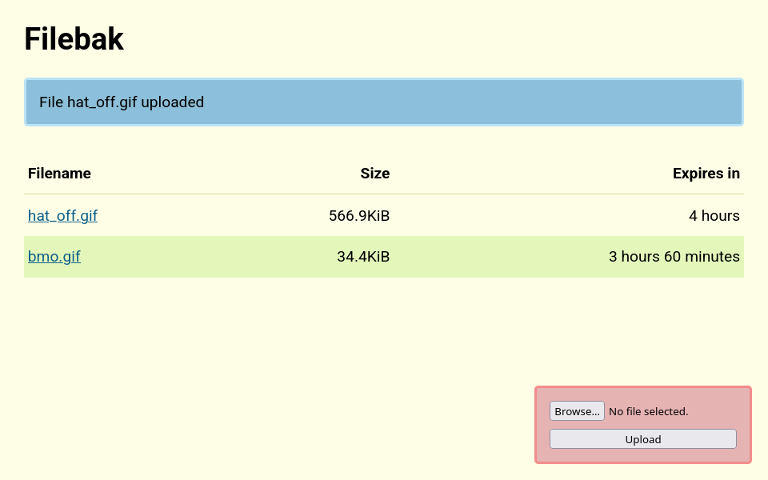

# Filebak

Upload files for sharing, after a while they get removed again.

Filebak was created for our local CoderDojo, where at the end of the dojo we needed a way to get the Scratch projects of all the kids onto a single laptop for demos.

```
clojure -M -m casa.squid.filebak --help
```

Flags can be set on the command line, or via env vars.

e.g. `--port 1234` or `FILEBAK_PORT=1234`.

Flags

```
--port <port>
--max-file-size <bytes>
--upload-dir <path>
--expiration-time <sec>
--basic-auth-username <user>
--basic-auth-password <password>
```

Setting either a username or password will enable basic auth.



## License

Copyright &copy; 2020 Arne Brasseur and Contributors

Licensed under the term of the Mozilla Public License 2.0, see LICENSE.

